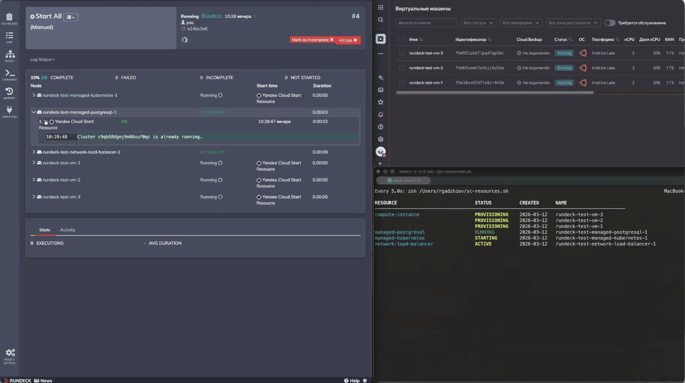

# rundeck-yc-scheduler

[](https://github.com/itruslan/rundeck-yc-scheduler/actions/workflows/build.yml)
[](https://github.com/itruslan/rundeck-yc-scheduler/actions/workflows/e2e-all.yml)

Scheduled start/stop of [Yandex Cloud](https://yandex.cloud/) resources via [Rundeck](https://www.rundeck.com/). Cut costs on non-production environments without changing your infrastructure.

<p align="center">
  <a href="rundeck.png"></a>
</p>

## How it works

```text
                     ┌──────────────────────────────────────────┐
                     │  Rundeck                                 │
                     │                                          │
                     │  cron schedule                           │
                     │       │                                  │
                     │       ▼                                  │
                     │  yc-node-source          yc-stop/start   │
                     │  ┌─────────────────┐    ┌─────────────┐  │
                     │  │ lists resources │───▶│ calls YC API│  │
                     │  │ as Rundeck nodes│    │ per node    │  │
                     │  └────────┬────────┘    └──────┬──────┘  │
                     └───────────┼────────────────────┼─────────┘
                                 │                    │
                                 ▼                    ▼
                            YC List API       YC Stop/Start API
```

Resources in a YC folder are discovered via `yc-node-source` and exposed as Rundeck nodes. You then create scheduled jobs using `yc-stop` / `yc-start` that target:

- a single resource
- a group of resources filtered by type or YC label
- an entire YC folder

All operations are idempotent — resources already in the target state are skipped. Each job executes per node, with optional parallelism configured at the job level. Label-based node filters let you exclude specific resources from a job without changing infrastructure (e.g. tag a resource `no_shutdown: "true"` and filter it out).

## Supported resource types

| Type | Status | Since |
| --- | --- | --- |
| `compute-instance` | ✅ done | 0.1.0 |
| `managed-postgresql` | ✅ done | 0.1.0 |
| `managed-kubernetes` | ✅ done | 0.1.0 |
| `network-load-balancer` | ✅ done | 0.1.0 |
| `managed-kafka` | ✅ done | 0.2.0 |
| `application-load-balancer` | ✅ done | 0.3.0 |
| `managed-redis` | ✅ done | 0.4.0 |
| `managed-clickhouse` | ✅ done | 0.5.0 |
| `managed-mysql` | ✅ done | 0.6.0 |
| `managed-opensearch` | 🔜 planned | — |
| `managed-mongodb` | 🔜 planned | — |
| `ydb` | 🔜 planned | — |

## Quick start

### 1. Pull or build the image

```bash
docker pull ghcr.io/itruslan/rundeck-yc-scheduler:latest
# or build locally
docker build -t rundeck-yc-scheduler .
```

### 2. Run Rundeck

See [Docker deployment guide](examples/deployment/docker/) or [Ansible role](examples/deployment/ansible/).

### 3. Configure projects and jobs

- [Terraform module](examples/configuration/terraform-rundeck-yc-scheduler/) — recommended
- [Manual setup via UI](examples/configuration/manual-rundeck/) — step-by-step guide

## Ideas & future work

- **OIDC authentication example** — add a ready-to-use configuration example for SSO via Keycloak, Authentik, or Okta
- **More resource types** — see planned entries in the table above
- **Dry-run mode** — log what would be stopped/started without actually calling the API, useful for auditing schedules
- **Configurable operation timeout** — expose `operation_timeout` as a Rundeck job option so users can tune wait time per job without rebuilding the image
- **Kubernetes deployment example** — add `examples/deployment/kubernetes/` with Deployment, Service, ConfigMap, Secret, and PVC manifests alongside the existing Docker and Ansible examples

## Development

```bash
uv venv && source .venv/bin/activate
uv pip install -r requirements.txt -r requirements-dev.txt
pre-commit install

pytest          # unit tests
docker build .  # build image
```

## License

This project is licensed under the [MIT License](LICENSE).

The Docker image is built on [Rundeck](https://www.rundeck.com/), which is licensed under the [Apache License 2.0](https://www.apache.org/licenses/LICENSE-2.0).
