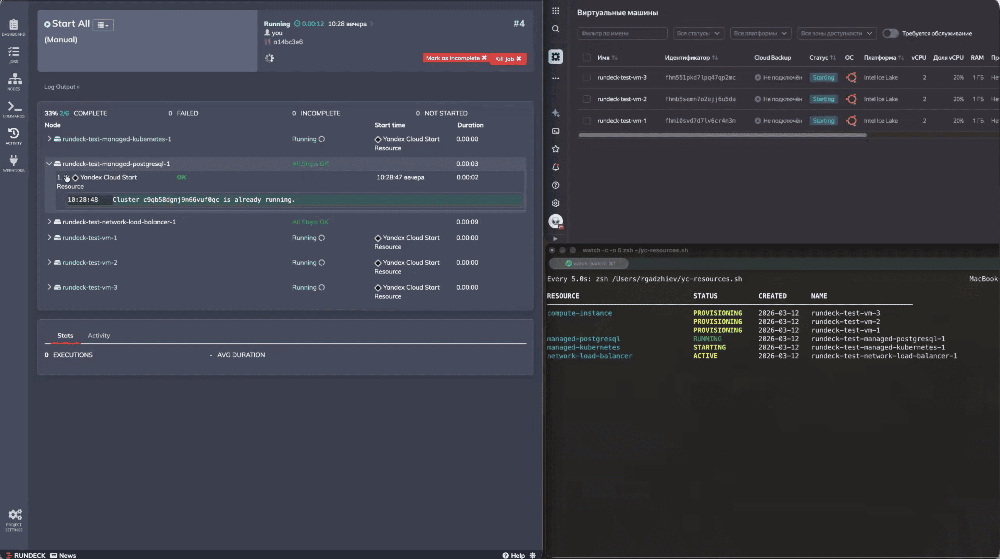

# rundeck-yc-scheduler

[](https://github.com/itruslan/rundeck-yc-scheduler/actions/workflows/build.yml)
[](https://github.com/itruslan/rundeck-yc-scheduler/actions/workflows/e2e-all.yml)

Scheduled start/stop of [Yandex Cloud](https://yandex.cloud/) resources via [Rundeck](https://www.rundeck.com/). Cut costs on non-production environments without changing your infrastructure.

<p align="center">
  <a href="rundeck.png"></a>
</p>

## How it works

```text
                     ┌──────────────────────────────────────────┐
                     │  Rundeck                                 │
                     │                                          │
                     │  cron schedule                           │
                     │       │                                  │
                     │       ▼                                  │
                     │  yc-node-source          yc-stop/start   │
                     │  ┌─────────────────┐    ┌─────────────┐  │
                     │  │ lists resources │───▶│ calls YC API│  │
                     │  │ as Rundeck nodes│    │ per node    │  │
                     │  └────────┬────────┘    └──────┬──────┘  │
                     └───────────┼────────────────────┼─────────┘
                                 │                    │
                                 ▼                    ▼
                            YC List API       YC Stop/Start API
```

Resources in a YC folder are discovered via `yc-node-source` and exposed as Rundeck nodes. You then create scheduled jobs using `yc-stop` / `yc-start` that target:

- a single resource
- a group of resources filtered by type or YC label
- an entire YC folder

All operations are idempotent — resources already in the target state are skipped. Each job executes per node, with optional parallelism configured at the job level. Label-based node filters let you exclude specific resources from a job without changing infrastructure (e.g. tag a resource `no_shutdown: "true"` and filter it out).

## Features

- **12 supported resource types** — compute instances, managed databases (PostgreSQL, MySQL, MongoDB, ClickHouse, Redis, Kafka, OpenSearch), Kubernetes clusters, load balancers (NLB, ALB), YDB
- **Idempotent operations** — resources already in the target state are silently skipped
- **Label-based exclusions** — exclude individual resources from jobs via YC labels without touching infrastructure
- **Execution ordering** — control stop/start order across resource types via `stop_order`
- **Configurable operation timeout** — set per job how long to wait for a YC operation to complete (default: 300 s; recommended 900 s for Kubernetes and YDB)
- **Terraform module** — manage all projects and schedules as code
- **Docker image** — Rundeck with the plugin pre-installed, ready to run

## Plugin configuration

### yc-node-source

| Parameter | Description | Default |
| --- | --- | --- |
| `folder_id` | Yandex Cloud folder ID to list resources from | — (required) |
| `yc_sa_key` | Path to the base64-encoded service account JSON key in Key Storage | — (required) |

### yc-stop / yc-start

| Parameter | Description | Default |
| --- | --- | --- |
| `yc_sa_key` | Path to the base64-encoded service account JSON key in Key Storage | — (required) |
| `operation_timeout` | Maximum seconds to wait for a YC operation to complete | `300` |

`operation_timeout` is set per job step — in the Rundeck UI (edit workflow → step settings) or via the Terraform module's `operation_timeout` field in `resource_types`.

## Supported resource types

- `compute-instance`
- `managed-postgresql`
- `managed-kubernetes`
- `network-load-balancer`
- `managed-kafka`
- `application-load-balancer`
- `managed-redis`
- `managed-clickhouse`
- `managed-mysql`
- `managed-mongodb`
- `managed-opensearch`
- `ydb`

## Quick start

### 1. Pull or build the image

```bash
docker pull ghcr.io/itruslan/rundeck-yc-scheduler:latest
# or build locally
docker build -t rundeck-yc-scheduler .
```

### 2. Run Rundeck

See [Docker deployment guide](examples/deployment/docker/) or [Ansible role](examples/deployment/ansible/).

### 3. Configure projects and jobs

- [Terraform module](examples/configuration/terraform-rundeck-yc-scheduler/) — recommended
- [Manual setup via UI](examples/configuration/manual-rundeck/) — step-by-step guide

## Ideas & future work

- **OIDC authentication example** — add a ready-to-use configuration example for SSO via Keycloak, Authentik, or Okta
- **Dry-run mode** — log what would be stopped/started without actually calling the API, useful for auditing schedules
- **Kubernetes deployment example** — add `examples/deployment/kubernetes/` with Deployment, Service, ConfigMap, Secret, and PVC manifests alongside the existing Docker and Ansible examples

## Development

```bash
uv venv && source .venv/bin/activate
uv pip install -r requirements.txt -r requirements-dev.txt
pre-commit install

pytest          # unit tests
docker build .  # build image
```

## License

This project is licensed under the [MIT License](LICENSE).

The Docker image is built on [Rundeck](https://www.rundeck.com/), which is licensed under the [Apache License 2.0](https://www.apache.org/licenses/LICENSE-2.0).
